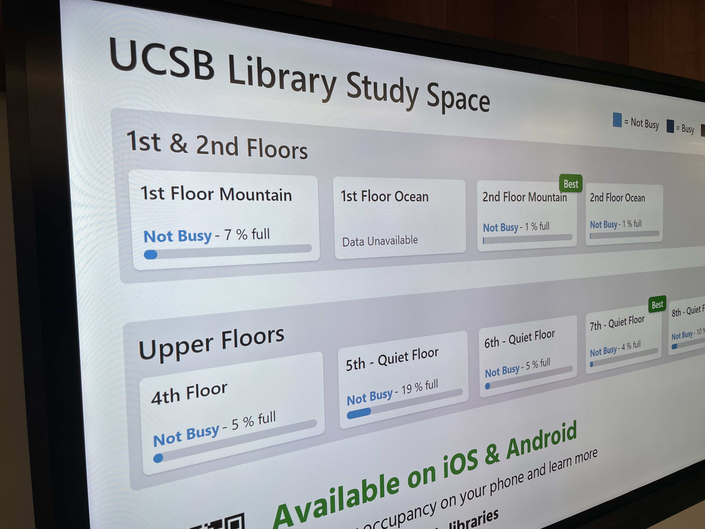

The [UCSB Library](https://www.library.ucsb.edu/) has subscribed to the [Occuspace](https://web.occuspace.io/) building occupancy monitoring service and associated [Waitz](https://www.waitz.io/) phone app since 2019.  The service periodically reports estimates of the number of people in different locations in the Library building by tracking wifi and bluetooth signals.  A Waitz display is shown below.

{width=80%}

This Shiny application allows the Waitz data to be interactively explored.

The raw data, obtained via the [Occuspace API](https://occuspace.io/api), consists of, for each location in the Library and for each hour of the day, the mean occupancy of the location over the hour.  Occupancy is reported as both raw counts and percentages of capacity.  The API can also return peak values and other variables such as dwell time, but those are unused here.

Because Library use is driven by the academic calendar and comparisons are for the most part only relevant in that context, we restrict the data to Fall, Winter, and Spring quarters; breaks and summer sessions are excluded.

To support consistent comparisons across and within quarters, we regularize the data as follows:

- Quarter weeks start on Sunday.  Thus, regardless of which day of the week the first day of a quarter falls on, it is in week 1, and the following Monday is in week 2.

- Quarters are adjusted to have the same length.  (All quarters have the same number of teaching days, but due to holidays, Fall quarters have 4 extra days and are 1 week longer than Winter and Spring quarters.)  For Fall quarters, we exclude the week containing Thanksgiving.  In this way all quarters have exactly 11 weeks, and weeks 10 and 11 are always dead week and finals week, respectively.

Note that percentages are averaged over every day of the week and over every hour of the day, including nighttime.  This can cause percentages to appear lower than might be expected.  Check the "Restrict to building hours" box to compute averages over the Library's nominal open hours (8am-8pm, though actual hours vary some over the course of a quarter).
